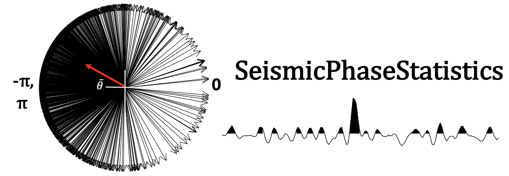
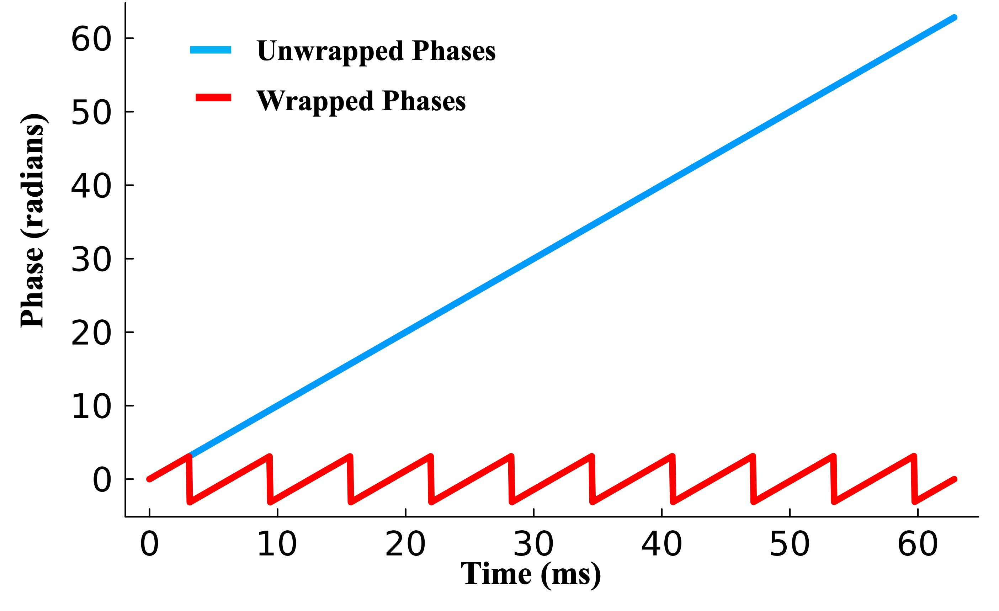

  

Code and data accompanying publications on Data-Driven Seismic Phase Analysis using Circular Statistics.

Each subdirectory corresponds to a published or submitted paper and is self-contained: you can reproduce a paper's results by working entirely within its folder.

## Phase Wrapping and Unwrapping

Instantaneous phase, by construction, is only defined modulo $2\pi$: the arctangent used to compute it from a complex (analytic) signal always returns a value in $(-\pi, \pi]$. As phase accumulates over time, it "wraps" around this interval every time it crosses a $\pm\pi$ boundary, producing the sawtooth pattern below. The true, continuously accumulating phase (unwrapped) is recovered by adding or subtracting multiples of $2\pi$ at each discontinuity so the sequence increases smoothly.

  
  
<em>Figure 3 from Rohatgi et al., 2025, <a href="https://doi.org/10.1190/tle44090683.1">The Leading Edge</a>.</em>

This distinction matters throughout the circular-statistics framework used in this repository: raw (wrapped) phase differences between traces or gathers can appear artificially large or discontinuous near the $\pm\pi$ boundary, which is exactly the kind of artifact that circular statistics (e.g., circular variance, mean resultant length) are designed to handle correctly — unlike linear statistics, which implicitly assume phase has already been unwrapped or lives on a line rather than a circle.

## Circular Statistics and the Von Mises Distribution

Because phase is a circular quantity (0 and $2\pi$ represent the same value), standard linear statistics don't apply directly. For example, the arithmetic mean of angles $1°$ and $359°$ is $180°$ — the point diametrically opposite both — when the intuitive "average" is clearly $0°$. Circular statistics resolves this by treating each phase value as a unit vector on the complex plane and computing statistics on those vectors rather than on the raw angles.

**Mean resultant length and circular variance.** For a set of phase angles $\theta_1, \dots, \theta_n$, the mean resultant vector is

$$\bar{R} = \frac{1}{n}\sum_{j=1}^{n} e^{i\theta_j}$$

Its magnitude $R = |\bar{R}| \in [0, 1]$ measures how tightly clustered the angles are ($R = 1$: perfectly aligned; $R = 0$: uniformly scattered). Circular variance is then defined as

$$V = 1 - R$$

which is the quantity used throughout this repository as a phase-coherence / quality-control attribute — low $V$ (high $R$) indicates coherent, well-aligned phase across traces or offsets; high $V$ indicates phase scatter consistent with noise or scattering.

**Von Mises distribution.** The Von Mises distribution is the circular analogue of the Gaussian, and is the natural parametric model for phase angles clustered around a mean direction $\mu$:

$$f(\theta \mid \mu, \kappa) = \frac{1}{2\pi I_0(\kappa)} e^{\kappa \cos(\theta - \mu)}$$

where $\kappa \geq 0$ is the concentration parameter (analogous to inverse variance) and $I_0(\kappa)$ is the modified Bessel function of the first kind, order 0. As $\kappa \to 0$, the distribution approaches uniform on the circle (fully random phase); as $\kappa \to \infty$, it approaches a point mass at $\mu$ (perfectly coherent phase). The maximum-likelihood estimate of $\kappa$ is obtained from the sample $R$, linking the descriptive statistic above directly to this generative model.

These tools — mean resultant length, circular variance, and the Von Mises distribution — form the statistical backbone of the phase-based QC attributes developed across the papers in this repository (see `CircStats.jl` usage within each paper folder).

## License

Released under the [MIT License](./LICENSE) unless noted otherwise within a paper folder.

## Contact

Akshika Rohatgi — [GitHub @arohatgi29](https://github.com/arohatgi29)

Issues and questions are welcome via the [Issues tab](https://github.com/arohatgi29/SeismicPhaseStatistics/issues).
