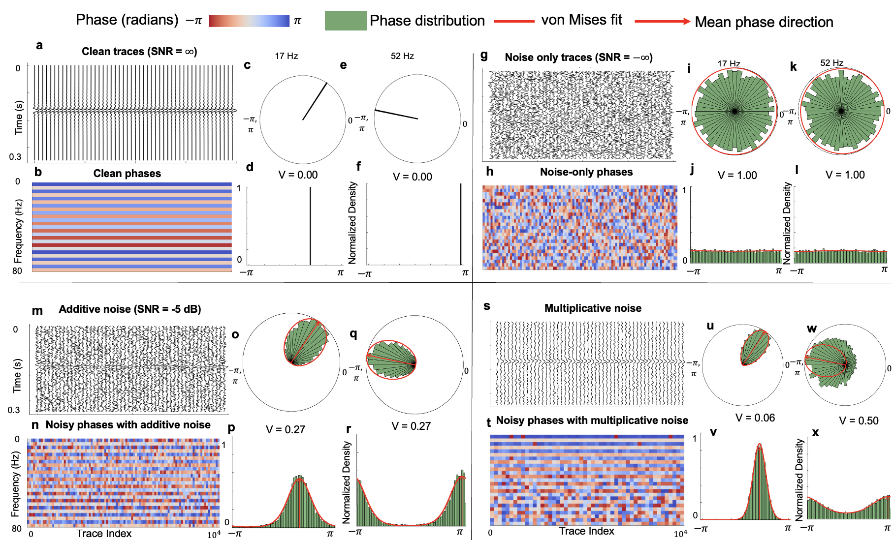
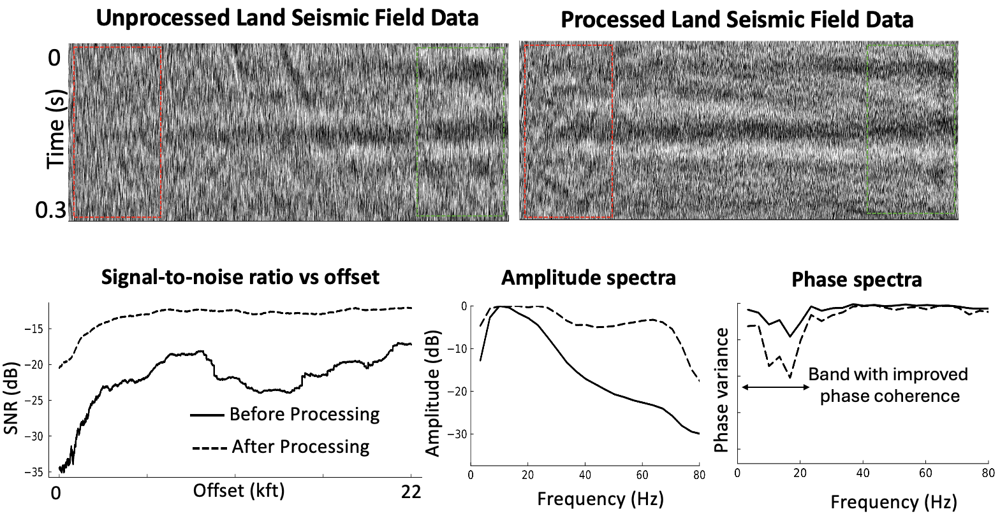

# Phase Variance as a Seismic Quality-Control Attribute

[](Preprint.pdf)
[](code.pdf)
[](notebook.jl)
[](https://julialang.org/)

**Akshika Rohatgi¹, Andrey Bakulin¹, and Sergey Fomel¹ (2025)**  
*Submitted to Sensors Special issue:Acquisition and Processing of Seismic Signals*

¹ University of Texas at Austin, Bureau of Economic Geology

---

## Overview

<p align="center">
  
  <br>
</p>

Seismic wavefields recorded on land are strongly distorted by near-surface heterogeneity, which introduces trace-specific, frequency-dependent phase perturbations that persist even after advanced time processing. Conventional processing relies primarily on surface-consistent deconvolution, which targets long- to mid-wavelength phase variability but is inherently unable to correct localized, non-surface-consistent phase distortions.

We introduce **phase variance** as a seismic quality-control attribute by treating seismic phases as circular random variables and analyzing local trace ensembles using circular statistics. This data-driven measure quantifies localized phase dispersion without phase unwrapping, enabling analysis of local phase trends and fluctuations without global assumptions or wavelet models.

Phase variance is computed automatically and provides frequency-by-frequency classification of the data, ranging from coherent signal behavior to fully randomized, noise-dominated phase. Application to field prestack land data shows that conventional processing reduces phase variability primarily in the low-to-intermediate frequency range, while the highest and lowest frequencies often show little improvement in phase coherence.

## Result

<p align="center">
  
  <br>
</p>

---

## Repository Contents

| File | Description |
|------|-------------|
| `Preprint.pdf` | Preprint of the paper |
| `code.pdf` | Complete code associated with the paper |
| `notebook.jl` | Reproducible Pluto notebook |

---

## Getting Started

### Prerequisites

- [Julia](https://julialang.org/downloads/) (≥ 1.9 recommended)

### Install Pluto

Launch Julia and install the Pluto package:

```julia
using Pkg
Pkg.add("Pluto")
```

### Run the Notebook

```bash
# Clone the repository
git clone https://github.com/arohatgi29/SeismicPhaseStatistics/Rohatgi-etal-2026-Sensors.git
cd Rohatgi-etal-phase-variance-qc.git
```

From the Julia REPL:

```julia
using Pluto
Pluto.run(notebook="notebook.jl")
```

This will open the Pluto notebook in your browser. Any dependencies used in the notebook will be installed automatically by Pluto's built-in package manager.


## License

Please refer to the paper and journal for terms of use.

---

## Contact

For questions or feedback, please open an [issue](../../issues) or email [akshikarohatgi@utexas.edu](mailto:akshikarohatgi@utexas.call).
